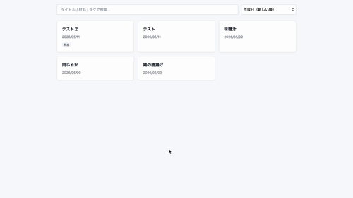
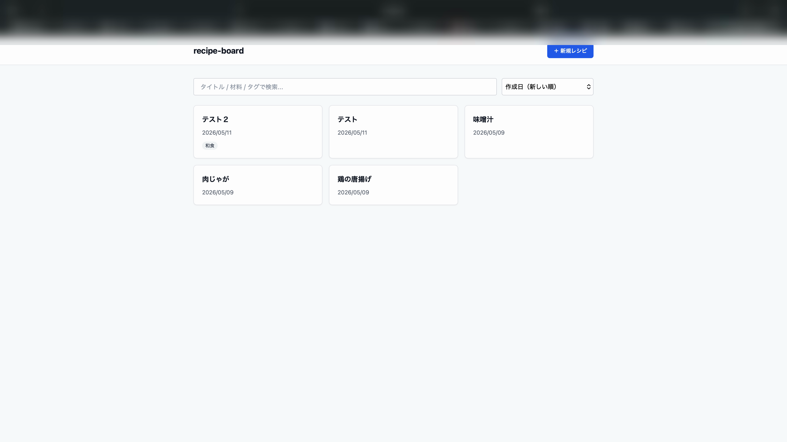
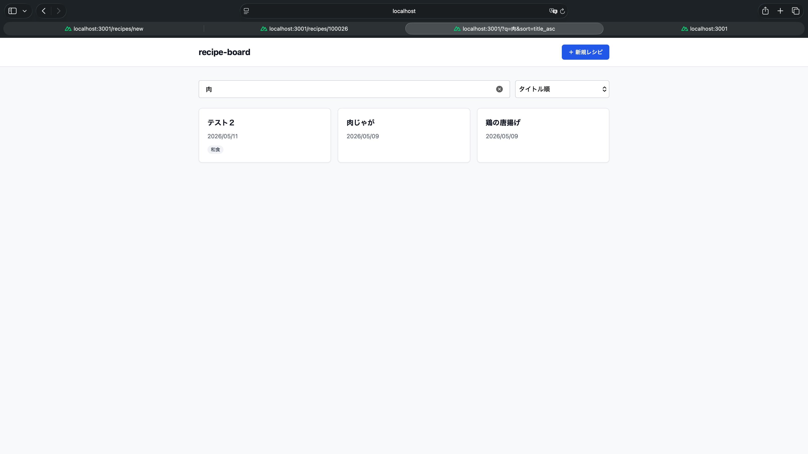
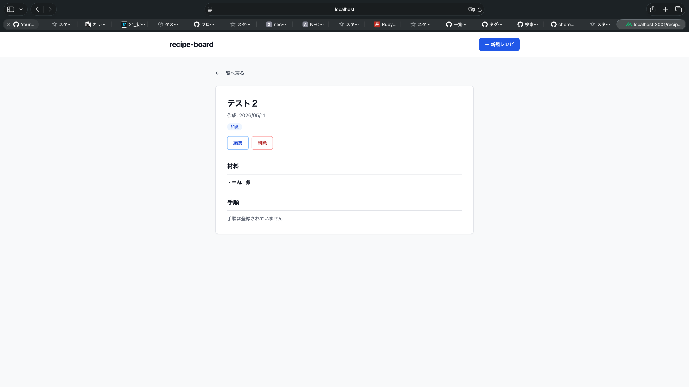
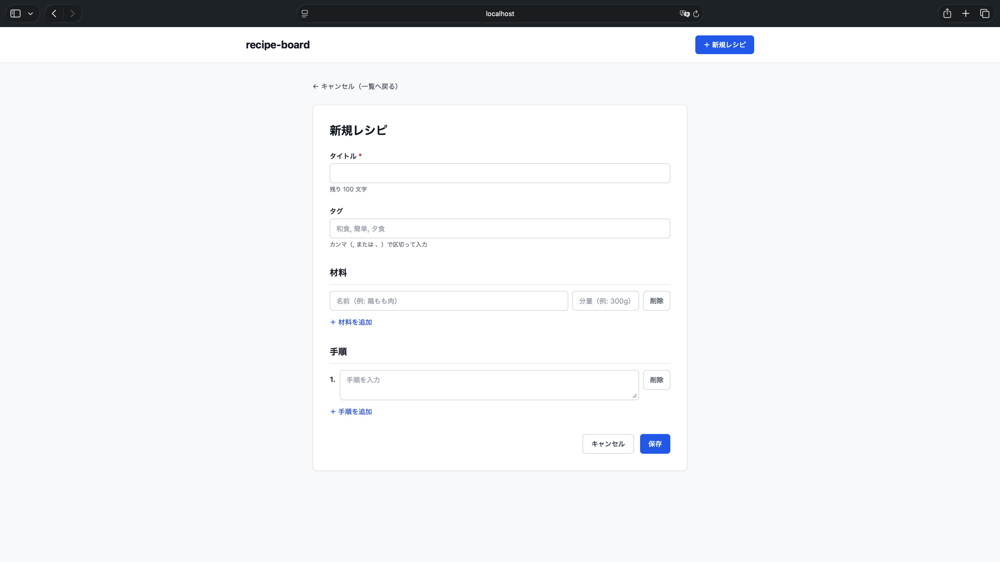

# レシピ管理アプリ (Recipe Board)

> 自分の作ったレシピを登録・閲覧・検索できる Web アプリです。
> スクール提出物として、**Ruby on Rails 8.1** + **Nuxt 4** + **MySQL 8** を組み合わせ、AWS 無料枠で本番デプロイまで実施しました。

---

## 🎬 動作デモ



> 一覧 → 検索 → ソート → 新規登録 → 詳細 / 編集 までの主要操作を 1 分弱で見られます（音声なし）。

---

## 🖼️ スクリーンショット

### 一覧画面（タグ表示・検索・ソート）


### 検索 + ソート動作中


### 詳細画面（タグ・材料・手順）


### 新規登録フォーム（タグ入力欄つき）


> 動作環境: ローカル（macOS / Safari）。AWS 無料枠での本番デプロイも完了済み。

---

## 主要機能

### MVP（要件定義書 3-1）
- レシピの登録 / 一覧 / 詳細 / 編集 / 削除
- 材料・手順をネスト形式で 1 画面から登録 / 編集
- バリデーション（タイトル必須・最大文字数等）
- 削除モーダルで誤操作防止

### Phase 2（要件定義書 3-2 / 余裕枠）
- **タグ機能**: 自由なタグでレシピを分類（カンマ区切り入力 + chip 表示）
- **検索**: タイトル / 材料名 / タグ名の OR 横断検索（部分一致）
- **ソート**: 作成日順 / 更新日順 / タイトル順

> Phase 3（画像アップロード / お気に入り / カテゴリ別 / モバイル Safari 対応）は提出後発展枠。

---

## 技術スタック

| レイヤー | 採用技術 |
|---|---|
| バックエンド | Ruby 3.4.9 / Rails 8.1.3（API モード） |
| フロントエンド | Nuxt 4.4 / Vue 3 / TypeScript / Tailwind CSS |
| DB | MySQL 8.x（ローカル: Docker / 本番: AWS RDS） |
| インフラ | AWS EC2 (t3.micro) + RDS (db.t3.micro) + EIP / Terraform |
| Web サーバ | Nginx（リバースプロキシ） |
| 開発支援 | Claude Code（AI 開発支援） |

### 使用ポート
| サービス | ポート |
|---|---|
| Rails | 3000 |
| Nuxt | 3001 |
| MySQL | 3306 |

---

## クイックスタート

### 前提
- macOS / Linux
- Docker Desktop インストール済み
- Ruby 3.4.9（rbenv 等で管理）
- Node.js v22 以上

### 起動

```bash
# 1. クローン
git clone https://github.com/80-cloud/recipe-board.git
cd recipe-board

# 2. 環境変数を準備（初回のみ）
cp .env.example .env
# .env を編集（DB パスワード等を設定）
# Rails の SECRET_KEY_BASE は `cd backend && bundle exec rails secret` で生成

# 3. MySQL を Docker で起動
docker compose up -d

# 4. バックエンド（Rails）を起動
cd backend
bundle install
bin/rails db:create db:migrate
bin/rails s -p 3000

# 5. フロントエンド（Nuxt）を起動（別ターミナル）
cd frontend
npm install
npm run dev
# → http://localhost:3001 でアクセス
```

### 起動確認

| サービス | URL | 期待値 |
|---|---|---|
| Rails (API) | http://localhost:3000/api/recipes | JSON 配列 |
| Nuxt (Frontend) | http://localhost:3001 | レシピ一覧画面 |
| MySQL | port 3306 | `docker ps` で `(healthy)` |

### 停止

```bash
# Rails / Nuxt は Ctrl+C
docker compose stop          # MySQL 停止（データ保持）
docker compose down -v       # MySQL 停止 + データ削除（注意）
```

---

## ディレクトリ構成

```
recipe-board/
├── README.md                 ← このファイル
├── OPERATIONS.md             ← 運用方針（リポジトリ閲覧者・講師向け）
├── CLAUDE.md                 ← Claude Code 行動規範（AI/開発者向け詳細）
├── docker-compose.yml        ← ローカル MySQL 起動
├── backend/                  ← Rails アプリ（API モード）
│   ├── app/models/           ← Recipe / Ingredient / Step / Tag / RecipeTag
│   ├── app/controllers/api/  ← RecipesController（CRUD + 検索 + ソート）
│   └── db/migrate/           ← 5 migrations
├── frontend/                 ← Nuxt 4 アプリ
│   └── app/
│       ├── pages/            ← S-01〜S-04 の 4 画面
│       ├── components/       ← RecipeCard / Header / Modal 等
│       ├── composables/      ← useRecipes（一覧・詳細・CRUD）
│       └── utils/            ← tags（カンマ区切り変換）
├── infra/                    ← Terraform（VPC / EC2 / RDS / EIP / SG）
├── docs/                     ← 設計ドキュメント
│   ├── 要件定義書.md
│   ├── 画面設計書.md
│   ├── DB設計書.md
│   ├── learning-notes.md     ← 開発中の学び（PDCA(S) の S）
│   ├── screenshots/          ← 動作スクリーンショット
│   ├── incidents/            ← 過去事故ライブラリ
│   └── test-protocols/       ← scout-drone-protocol v3.5
└── .github/                  ← Issue / PR テンプレート / Actions
```

---

## 開発状況（2026-05-11 時点）

| 段階 | 状態 |
|---|---|
| **MVP** 3-1（CRUD・材料・手順） | ✅ 完成 |
| **Phase 2** 3-2: タグ機能 | ✅ PR #111 + #113 |
| **Phase 2** 3-2: 検索（タイトル + 材料 + タグ） | ✅ PR #107 + #115 |
| **Phase 2** 3-2: ソート | ✅ PR #109 |
| **Phase 3** 3-3 | 未着手（提出後発展） |
| **AWS Phase 4** デプロイ | ✅ B-1〜B-8 完了 |
| **修練城**（多層防御の総称）v3.5 + 整備 #1〜#8 | ✅ 運用中 |

→ 要件定義書 3-1〜3-2 フル達成。

---

## 学習成果として意識したこと

スクール課題の主目的である「Rails / Vue / MySQL の習得」に加え、現場の開発フローを意識して以下を実践しました。

### 1. Issue → ブランチ → PR → マージ ワークフローの厳守
- 直接 main への push を **branch protection で禁止**
- すべての変更を PR 経由で実施（本リポジトリは 100+ PR）
- 日本語の Conventional Commits 規約

### 2. 過去事故から学ぶ訓練フェーズ運用（修練城（多層防御の総称） / scout-drone-protocol（着手前検証プロトコル）v3.5）
- 着手前の **Phase 1 斥候（着手前の事前調査）** で過去事故ライブラリと突合
- 罠の予兆（バグの危険兆候）を検知 → 整備 → 本体実装の標準シーケンス
- 詳細: [`docs/test-protocols/scout-drone-protocol.md`](docs/test-protocols/scout-drone-protocol.md)

### 3. AI（Claude Code）と協働する誤操作防止の多層防御
- pre-commit hook で機密情報を自動スキャン（gitleaks）
- Terraform リソースに `prevent_destroy` / `deletion_protection`
- Claude Code の Hook で破壊的コマンドを正規表現で再判定
- AI 利用方針は `CLAUDE.md` セクション 13 を参照

### 4. インシデント記録の永続化
- 開発中に発生した「奇襲（想定外バグ）」「光学迷彩（隠れた不具合）」を [`docs/incidents/INDEX.md`](docs/incidents/INDEX.md) に記録
- 同型事故の再発予防を構造化

### 5. 提出時の運用モード（緩める / 緩めない の境界明文化）
- `incident-library 後追い` 等は緩和可
- `gitleaks / branch protection / PR ベース` 等は提出時でも維持
- 詳細: `CLAUDE.md` セクション 18

---

## 関連ドキュメント

| ファイル | 目的 |
|---|---|
| [`OPERATIONS.md`](./OPERATIONS.md) | プロジェクト運用方針（リポジトリ閲覧者・講師向け） |
| [`CLAUDE.md`](./CLAUDE.md) | Claude Code 行動規範（AI/開発者向け） |
| [`docs/要件定義書.md`](docs/要件定義書.md) | 要件・スコープ定義 |
| [`docs/画面設計書.md`](docs/画面設計書.md) | 4 画面 + 遷移図 |
| [`docs/DB設計書.md`](docs/DB設計書.md) | テーブル定義 |
| [`docs/learning-notes.md`](docs/learning-notes.md) | 開発中の学び・PDCA(S) の S |

---

## 機密情報の取り扱い

本リポジトリでは前プロジェクトでの機密情報漏洩事故の教訓を踏まえ、**pre-commit hook で機密情報を自動スキャン**しています。

- `.env` は `.gitignore` で除外済み（コミット不可）
- パスワード・API キー・トークンは `.env` 以外に書かない
- `git commit` 時に gitleaks が自動検知でブロック
- AWS 識別子（Account ID / EIP / 自宅 IP 等）はサンプル値（例: `<EC2_EIP>`）でマスク

> 閲覧目的でクローンする場合は pre-commit のインストールは不要です。

---

## ライセンス

学習用個人プロジェクト（スクール提出物）
