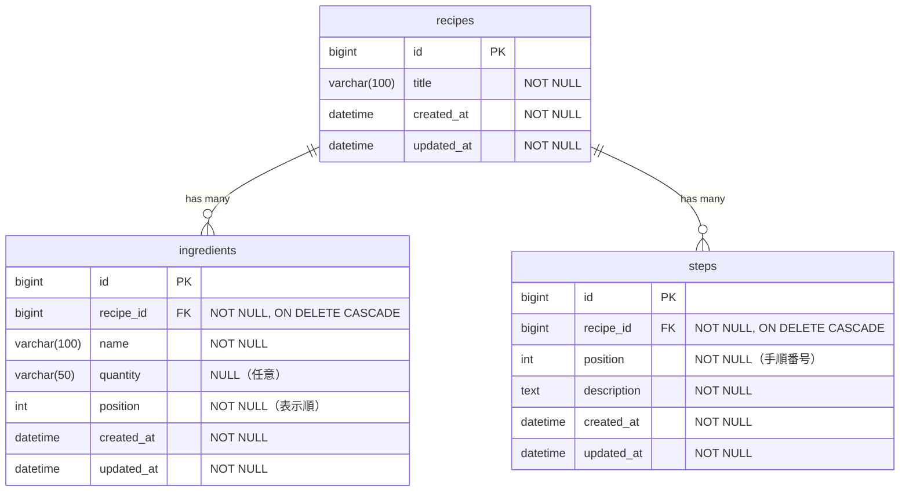

# DB 設計書 — レシピ管理アプリ (recipe-board)

> レシピ管理アプリ MVP のデータベース設計書。
> 要件定義書（[`要件定義書.md`](./要件定義書.md)）の機能要件を物理設計に落とし込む。

## 改訂履歴

| バージョン | 日付 | 内容 | 担当 |
|---|---|---|---|
| 0.1 | 2026-05-08 | 初版作成 | hideharu-AI |

## 関連ドキュメント

- [`要件定義書.md`](./要件定義書.md) — 機能要件の出元
- [`画面設計書.md`](./画面設計書.md) — UI とテーブル項目の対応（別途作成予定）
- [`learning-notes.md`](./learning-notes.md) — 設計判断の振り返り

---

## 1. 設計方針

### 1-1. 基本原則

| 原則 | 内容 |
|---|---|
| **拡張性優先** | MVP は最小だが、Phase 2/3 で追加するエンティティ（タグ・カテゴリ・画像）を**後から追加しやすい構造**にする |
| **正規化** | 1:N 関連を別テーブルで管理（材料・手順を JSON 配列でレシピに埋め込まない） |
| **Rails 規約に準拠** | snake_case / 複数形テーブル名 / bigint id / created_at・updated_at |
| **Cascade delete** | レシピ削除時、関連する材料・手順は自動削除（孤児を残さない） |

### 1-2. データベース・文字コード

| 項目 | 値 |
|---|---|
| DBMS | MySQL 8.x |
| 文字コード | `utf8mb4`（絵文字対応） |
| 照合順序 | `utf8mb4_unicode_ci` |
| ストレージエンジン | InnoDB（外部キー・トランザクション対応） |

---

## 2. ER 図



> ER 図は GitHub 上で Mermaid として自動描画されます。

---

## 3. テーブル定義

### 3-1. `recipes` テーブル（レシピ本体）

| カラム名 | 型 | NULL | デフォルト | 制約 | 説明 |
|---|---|---|---|---|---|
| `id` | BIGINT UNSIGNED | NO | AUTO_INCREMENT | PK | 主キー |
| `title` | VARCHAR(100) | NO | - | - | レシピ名 |
| `created_at` | DATETIME | NO | CURRENT_TIMESTAMP | - | 作成日時 |
| `updated_at` | DATETIME | NO | CURRENT_TIMESTAMP ON UPDATE | - | 更新日時 |

**制約・備考**:
- `title` は 1〜100 文字（空文字不可）。アプリ層でもバリデーション
- 将来 Phase 2/3 で以下のカラム追加を想定：
  - `description`（TEXT・任意）— レシピの説明
  - `image_url`（VARCHAR）— Phase 3 で画像 URL を保存
  - `category_id`（FK）— Phase 3 でカテゴリ機能
  - `is_favorite`（BOOLEAN）— Phase 3 でお気に入り

---

### 3-2. `ingredients` テーブル（材料）

| カラム名 | 型 | NULL | デフォルト | 制約 | 説明 |
|---|---|---|---|---|---|
| `id` | BIGINT UNSIGNED | NO | AUTO_INCREMENT | PK | 主キー |
| `recipe_id` | BIGINT UNSIGNED | NO | - | FK → recipes.id | 親レシピ |
| `name` | VARCHAR(100) | NO | - | - | 材料名（例: 鶏もも肉） |
| `quantity` | VARCHAR(50) | YES | NULL | - | 分量（例: 200g, 適量, 1/2 カップ） |
| `position` | INT | NO | 0 | - | 表示順（小さい順）|
| `created_at` | DATETIME | NO | CURRENT_TIMESTAMP | - | 作成日時 |
| `updated_at` | DATETIME | NO | CURRENT_TIMESTAMP ON UPDATE | - | 更新日時 |

**制約・備考**:
- `recipe_id` は外部キー、**ON DELETE CASCADE**（レシピ削除時に自動削除）
- `quantity` は文字列で柔軟に保存（数値 + 単位の組み合わせは MVP では実装しない）
- `position` は同じ recipe 内でユニークではない（複数の材料が同じ position でも許容、表示順は (position, id) でソート）

---

### 3-3. `steps` テーブル（手順）

| カラム名 | 型 | NULL | デフォルト | 制約 | 説明 |
|---|---|---|---|---|---|
| `id` | BIGINT UNSIGNED | NO | AUTO_INCREMENT | PK | 主キー |
| `recipe_id` | BIGINT UNSIGNED | NO | - | FK → recipes.id | 親レシピ |
| `position` | INT | NO | - | - | 手順番号（1, 2, 3...）|
| `description` | TEXT | NO | - | - | 手順テキスト |
| `created_at` | DATETIME | NO | CURRENT_TIMESTAMP | - | 作成日時 |
| `updated_at` | DATETIME | NO | CURRENT_TIMESTAMP ON UPDATE | - | 更新日時 |

**制約・備考**:
- `recipe_id` は外部キー、**ON DELETE CASCADE**
- `position` は同じ recipe 内で順序を定義（複合インデックス `(recipe_id, position)` で並び替え高速化）
- `description` は TEXT（最大 65,535 byte ≈ 21,000 字、長文の手順に対応）

---

## 4. インデックス設計

| テーブル | インデックス | 種別 | 目的 |
|---|---|---|---|
| `recipes` | `idx_recipes_title` on `title` | 通常 | タイトル検索（Phase 2 で追加予定） |
| `recipes` | `idx_recipes_created_at` on `created_at` DESC | 通常 | 一覧の作成日順ソート |
| `ingredients` | `idx_ingredients_recipe_id` on `recipe_id` | 通常 | レシピごとの材料取得 |
| `ingredients` | `idx_ingredients_recipe_position` on `(recipe_id, position)` | 複合 | 材料の表示順取得を高速化 |
| `steps` | `idx_steps_recipe_id` on `recipe_id` | 通常 | レシピごとの手順取得 |
| `steps` | `idx_steps_recipe_position` on `(recipe_id, position)` | 複合 | 手順の番号順取得を高速化 |

> **MVP 段階ではインデックスは最小限**にして、Phase 2 で検索機能追加時に必要なものを追加する。
> 早期最適化を避ける（測定してから対処の原則）。

---

## 5. 制約・関連

### 5-1. 外部キー制約

| 子テーブル | 子カラム | 親テーブル | 親カラム | ON DELETE |
|---|---|---|---|---|
| `ingredients` | `recipe_id` | `recipes` | `id` | CASCADE |
| `steps` | `recipe_id` | `recipes` | `id` | CASCADE |

**理由**:
- レシピを削除したら、その材料・手順は意味を失うため自動削除する
- 孤児レコードを残さない設計

### 5-2. アプリ層のバリデーション（Rails モデル）

| テーブル | カラム | バリデーション |
|---|---|---|
| `recipes` | `title` | presence: true / length: { maximum: 100 } |
| `ingredients` | `name` | presence: true / length: { maximum: 100 } |
| `ingredients` | `quantity` | length: { maximum: 50 }（任意） |
| `steps` | `description` | presence: true |
| `steps` | `position` | presence: true / numericality: { only_integer: true, greater_than: 0 } |

---

## 6. 命名規約

| 対象 | 規約 | 例 |
|---|---|---|
| テーブル名 | snake_case + 複数形 | `recipes`, `ingredients`, `steps` |
| カラム名 | snake_case | `recipe_id`, `created_at` |
| 主キー | `id`（bigint） | - |
| 外部キー | `<参照テーブル名（単数形）>_id` | `recipe_id` |
| インデックス名 | `idx_<テーブル名>_<カラム名>` | `idx_ingredients_recipe_id` |
| 日時カラム | `<動詞>_at` | `created_at`, `updated_at` |

> Rails のデフォルト規約に準拠することで、開発時の規約違反を最小化する。

---

## 7. 拡張性方針（Phase 2 / 3）

MVP では**最小 3 テーブル**だが、以下の拡張を見据えた構造になっている。

### 7-1. Phase 2（時間に余裕があれば）

| 機能 | 追加テーブル | 関連 |
|---|---|---|
| タグ機能 | `tags`(id, name) | recipes - tags は m:n。中間テーブル `recipe_tags`(recipe_id, tag_id) を追加 |
| 検索機能 | （新規テーブルなし） | `recipes.title` / `ingredients.name` にインデックス追加で実現 |
| ソート | （変更なし） | アプリ層で実装 |

### 7-2. Phase 3（提出後の発展）

| 機能 | 追加カラム / テーブル | 説明 |
|---|---|---|
| 画像アップロード | `recipes.image_url` (VARCHAR) または独立テーブル `recipe_images` | S3 等のストレージ URL を保存 |
| お気に入り | `recipes.is_favorite` (BOOLEAN) | シングルユーザー前提なのでカラム追加で十分 |
| カテゴリ別表示 | `categories`(id, name) + `recipes.category_id` | recipes - categories は n:1（1 レシピ 1 カテゴリ） |

> Phase 3 のうち**画像アップロード**は要件定義書セクション 3-3 で定義済。
> 詳細は当該機能を実装する Issue で別途設計する。

---

## 8. マイグレーションの方針

### 8-1. 冪等性（task-board の教訓継承）

- task-board で「Flyway V3 が再実行で失敗」した事故あり（[learning-notes.md](./learning-notes.md) 参照）
- Rails の `db:migrate` も**冪等にする**：
  - `add_column :recipes, :description, :text` → 既に存在すればエラー
  - 対策: `change_table` 内で `if column_exists?` 等を使う、または `if_not_exists: true` オプションを利用

### 8-2. リバーシブル

- 各マイグレーションは `change` メソッドで書く（自動的に reversible になる）
- 複雑なロジックは `up` / `down` を明示的に書く

### 8-3. デプロイ前確認

- `bundle exec rails db:migrate:status` で全マイグレーション状態を確認
- 適用前後の `db/schema.rb` 差分をレビュー
- マイグレーション適用は `terraform apply` と同様、本番環境では**人間の承認をはさむ**

---

## 9. シードデータ（開発用）

### 9-1. シードデータの方針

- 開発時の動作確認用に `db/seeds.rb` でレシピ 3 件程度を投入
- 本番環境ではシードデータを投入しない
- 機密情報は含めない（CHANGE_ME 等のプレースホルダーも使わない）

### 9-2. シード例（具体例）

```ruby
# db/seeds.rb 例
recipe = Recipe.create!(title: "鶏の唐揚げ")
recipe.ingredients.create!([
  { name: "鶏もも肉", quantity: "300g", position: 1 },
  { name: "醤油",     quantity: "大さじ 2", position: 2 },
])
recipe.steps.create!([
  { position: 1, description: "鶏肉を一口大に切る" },
  { position: 2, description: "調味料を混ぜて漬け込む" },
])
```

---

## 10. データ量の想定

| 項目 | 想定値 |
|---|---|
| 想定レシピ数 | 〜500 件（要件定義書セクション 4） |
| 1 レシピあたりの材料数 | 平均 8 件（最大 30 件） |
| 1 レシピあたりの手順数 | 平均 6 件（最大 20 件） |
| 全体のレコード数 | 500 + 500×8 + 500×6 ≈ 7,500 行 |

> 個人利用前提でデータ量は小さい。MySQL の性能ボトルネックは無視できる。
> ただし、Phase 2 で他人のレシピもインポートする等の拡張があれば再設計する。

---

## 11. セキュリティ・機密情報

- DB 接続情報（host / username / password）は環境変数で管理（`.env`）
- 平文パスワードは絶対にコミットしない（task-board の事故継承）
- `.gitleaks.toml` のカスタムルールで secret commit を検知（4 層防御）
- Rails の Strong Parameters でユーザー入力をホワイトリスト化

---

## 12. テスト方針

### 12-1. モデルテスト（Rails の RSpec / Minitest）

- 各モデルのバリデーション
- 関連（has_many / belongs_to）の動作
- Cascade delete の確認

### 12-2. データベーステスト

- マイグレーションの forward / backward 両方向の動作
- 外部キー制約の動作（孤児レコードができないこと）

---

## 13. 用語

| 用語 | 説明 |
|---|---|
| レシピ (recipe) | 1 つの料理の作り方を表すデータ単位 |
| 材料 (ingredient) | レシピに使う食材。名前と分量を持つ |
| 手順 (step) | レシピの調理ステップ。順番と説明を持つ |
| ER 図 | Entity-Relationship 図。テーブル間の関連を可視化 |
| Cascade delete | 親が削除されたら、子も自動的に削除される動作 |
| 1:N | 1 対多の関連（1 レシピが複数の材料を持つ） |
| m:n | 多対多の関連（タグ機能などで使う） |
