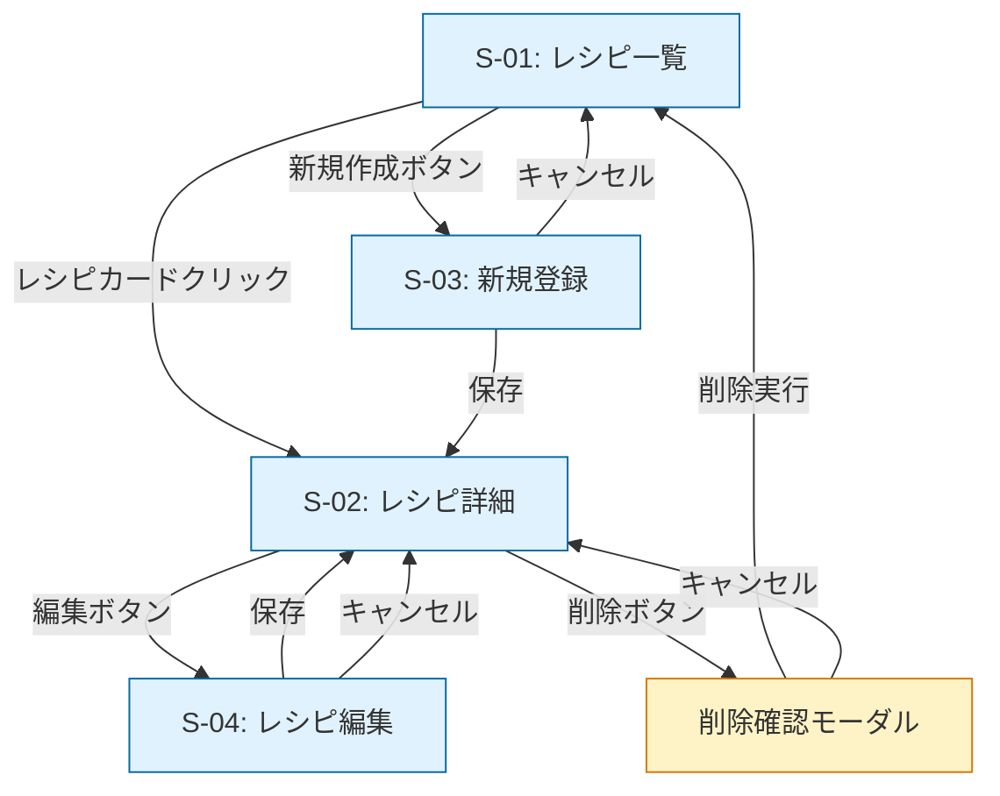

# 画面設計書 — レシピ管理アプリ (recipe-board)

> レシピ管理アプリ MVP の画面設計書。
> 要件定義書（[`要件定義書.md`](./要件定義書.md)）と DB 設計書（[`DB設計書.md`](./DB設計書.md)）を踏まえた UI 設計。

## 改訂履歴

| バージョン | 日付 | 内容 | 担当 |
|---|---|---|---|
| 0.1 | 2026-05-08 | 初版作成（MVP 4 画面） | hideharu-AI |

## 関連ドキュメント

- [`要件定義書.md`](./要件定義書.md) — 機能要件
- [`DB設計書.md`](./DB設計書.md) — テーブル定義（画面項目との対応）
- [`learning-notes.md`](./learning-notes.md) — 設計判断の振り返り

---

## 1. 設計方針

### 1-1. 基本原則

| 原則 | 内容 |
|---|---|
| **シンプル優先** | MVP は 4 画面で完結。装飾より機能を優先 |
| **Nuxt 3 規約準拠** | `pages/` 配下のファイル配置で自動ルーティング |
| **レスポンシブ最小** | MVP は PC（最小幅 1024px）のみ。Phase 3 でモバイル Safari 対応 |
| **CSS は Tailwind 中心** | カスタム CSS は最小限、ユーティリティクラスを活用 |
| **状態管理は最小** | Pinia / Composition API ベース、複雑な store は MVP では不要 |

### 1-2. 対象ブラウザ・解像度

| 観点 | 対応 |
|---|---|
| 対応ブラウザ | Chrome（最新）/ Safari（最新）|
| 想定解像度 | PC: 1024〜1920px |
| モバイル対応 | **MVP では非対応**。Phase 3 で対応予定 |
| 印刷 | スコープ外 |

---

## 2. 画面一覧

### 2-1. MVP の対象画面（4 画面）

| 画面ID | 画面名 | URL | 役割 |
|---|---|---|---|
| S-01 | レシピ一覧 | `/` | 登録済みレシピの一覧表示 |
| S-02 | レシピ詳細 | `/recipes/:id` | 1 件のレシピの全情報表示 |
| S-03 | レシピ新規登録 | `/recipes/new` | 新規レシピの作成フォーム |
| S-04 | レシピ編集 | `/recipes/:id/edit` | 既存レシピの編集フォーム |

### 2-2. Phase 2 で追加予定（時間が許せば）

| 画面ID | 画面名 | 備考 |
|---|---|---|
| S-05 | 検索結果 | 一覧画面の検索バー結果表示（独立画面ではなくクエリパラメータ） |

### 2-3. Phase 3 で追加予定（提出後の発展）

| 画面ID | 画面名 | 備考 |
|---|---|---|
| S-06 | お気に入り一覧 | `/favorites` |
| S-07 | カテゴリ別表示 | `/categories/:name` |

---

## 3. 画面遷移図



> Mermaid は GitHub 上で自動描画されます。

---

## 4. 各画面の詳細

### 4-1. S-01: レシピ一覧画面

| 項目 | 内容 |
|---|---|
| URL | `/` |
| 役割 | 登録済みレシピを一覧表示 |
| Nuxt page | `pages/index.vue` |

#### 主要要素

```
┌──────────────────────────────────────────┐
│  recipe-board       [＋ 新規レシピ]      │ ← ヘッダー
├──────────────────────────────────────────┤
│                                          │
│   ┌─────────────┐  ┌─────────────┐       │
│   │ 鶏の唐揚げ   │  │ 肉じゃが     │       │ ← レシピカード
│   │ 2026/05/08  │  │ 2026/05/07  │       │
│   └─────────────┘  └─────────────┘       │
│                                          │
│   ┌─────────────┐                        │
│   │ ...         │                        │
│   └─────────────┘                        │
│                                          │
└──────────────────────────────────────────┘
```

#### コンポーネント構成

- `<Header>` — タイトル + 新規作成ボタン
- `<RecipeCard>` — タイトル / 作成日 / クリックで詳細へ
- 件数 0 件のとき: `<EmptyState>` で「まだレシピがありません」表示

#### 連携 API

| メソッド | エンドポイント | 用途 |
|---|---|---|
| GET | `/api/recipes` | レシピ一覧取得（作成日降順） |

#### ローディング・エラー処理

- 取得中: スケルトン UI
- エラー時: 「読み込みに失敗しました」+ 再読み込みボタン

---

### 4-2. S-02: レシピ詳細画面

| 項目 | 内容 |
|---|---|
| URL | `/recipes/:id` |
| 役割 | 1 件のレシピの全情報表示 |
| Nuxt page | `pages/recipes/[id]/index.vue` |

#### 主要要素

```
┌──────────────────────────────────────────┐
│  ← 一覧へ戻る                            │
├──────────────────────────────────────────┤
│                                          │
│   鶏の唐揚げ                             │ ← タイトル
│   作成: 2026/05/08  更新: 2026/05/08    │ ← メタ情報
│                                          │
│   [編集] [削除]                          │ ← アクション
│                                          │
│   ── 材料 ────────                       │
│   ・鶏もも肉  300g                       │
│   ・醤油      大さじ 2                   │
│   ・...                                  │
│                                          │
│   ── 手順 ────────                       │
│   1. 鶏肉を一口大に切る                  │
│   2. 調味料を混ぜて漬け込む              │
│   3. ...                                 │
│                                          │
└──────────────────────────────────────────┘
```

#### 連携 API

| メソッド | エンドポイント | 用途 |
|---|---|---|
| GET | `/api/recipes/:id` | レシピ詳細取得（材料・手順を含む） |
| DELETE | `/api/recipes/:id` | 削除実行（モーダル確認後） |

#### 動作

- ID が存在しない場合: 404 表示 + 「一覧へ戻る」
- 削除ボタン押下: モーダル表示 → 確認後 DELETE → 一覧画面へリダイレクト

---

### 4-3. S-03: レシピ新規登録画面

| 項目 | 内容 |
|---|---|
| URL | `/recipes/new` |
| 役割 | 新規レシピの作成フォーム |
| Nuxt page | `pages/recipes/new.vue` |

#### 主要要素

```
┌──────────────────────────────────────────┐
│  ← キャンセル                            │
├──────────────────────────────────────────┤
│                                          │
│   新規レシピ                             │
│                                          │
│   タイトル *                             │
│   [_________________________________]    │
│                                          │
│   ── 材料 ────────                       │
│   名前        分量                       │
│   [_______]   [_______]    [削除]        │
│   [_______]   [_______]    [削除]        │
│   [＋ 材料を追加]                        │
│                                          │
│   ── 手順 ────────                       │
│   1. [_____________________]  [削除]     │
│   2. [_____________________]  [削除]     │
│   [＋ 手順を追加]                        │
│                                          │
│              [キャンセル]  [保存]        │
└──────────────────────────────────────────┘
```

#### コンポーネント構成

- `<RecipeForm>` — 共通フォーム（新規 / 編集で再利用）
- `<DynamicListEditor>` — 材料・手順の動的追加・削除

#### 連携 API

| メソッド | エンドポイント | 用途 |
|---|---|---|
| POST | `/api/recipes` | 新規レシピ作成（材料・手順をネスト送信） |

#### バリデーション

| 項目 | ルール |
|---|---|
| タイトル | 必須 / 1〜100 文字 |
| 材料.name | 100 文字以内（任意） |
| 材料.quantity | 50 文字以内（任意） |
| 手順.description | 必須（手順を追加した場合）|

#### 動作

- 「保存」押下: バリデーション → API → 成功で詳細画面 (S-02) へ遷移
- バリデーションエラー: 該当項目の下に赤字でメッセージ
- 「キャンセル」押下: 確認なしで一覧画面 (S-01) へ戻る（MVP では破棄確認なし）

---

### 4-4. S-04: レシピ編集画面

| 項目 | 内容 |
|---|---|
| URL | `/recipes/:id/edit` |
| 役割 | 既存レシピの編集 |
| Nuxt page | `pages/recipes/[id]/edit.vue` |

#### 主要要素

S-03 とほぼ同じ。違いは：
- タイトルが「レシピを編集」
- 既存値が初期表示
- 「キャンセル」で詳細画面 (S-02) へ戻る

#### 連携 API

| メソッド | エンドポイント | 用途 |
|---|---|---|
| GET | `/api/recipes/:id` | 初期値取得 |
| PATCH | `/api/recipes/:id` | 更新実行 |

---

## 5. 共通コンポーネント

| コンポーネント | 用途 | 使用画面 |
|---|---|---|
| `<Header>` | タイトル + 新規作成ボタン | S-01 |
| `<BackLink>` | 「← 一覧/詳細へ戻る」 | S-02, S-03, S-04 |
| `<RecipeCard>` | レシピカード（一覧用） | S-01 |
| `<RecipeForm>` | 共通フォーム | S-03, S-04 |
| `<DynamicListEditor>` | 材料・手順の動的入力 | S-03, S-04（RecipeForm 内）|
| `<DeleteConfirmModal>` | 削除確認モーダル | S-02 |
| `<EmptyState>` | 「まだレシピがありません」 | S-01 |
| `<LoadingSkeleton>` | 取得中の表示 | S-01, S-02 |
| `<ErrorState>` | エラー時の再読み込み UI | S-01, S-02 |

---

## 6. 入力バリデーション

### 6-1. クライアント側（Nuxt）

UX 重視で即時フィードバック。

| 項目 | 検証タイミング | エラーメッセージ |
|---|---|---|
| タイトル必須 | blur / submit | 「タイトルを入力してください」 |
| タイトル長さ | input | 「100 文字以内で入力してください（残り N 文字）」 |
| 手順 description 必須 | submit | 「手順を入力してください」 |

### 6-2. サーバー側（Rails）

最終防衛線。クライアントを通り抜けた値も catch する。
詳細は DB 設計書セクション 5-2 参照（Rails モデルバリデーション）。

> **重要**: クライアント側だけのバリデーションは**信頼してはいけない**。task-board の事故事例（[learning-notes.md](./learning-notes.md) 参照）でも「サーバーサイドバリデーションが後付け」だった経緯あり。

---

## 7. レスポンシブ方針

### 7-1. MVP（PC のみ）

| 解像度 | 対応 |
|---|---|
| 1024〜1920px | フル対応（メインターゲット） |
| 768〜1023px | 動作するが推奨外（明示的に「PC 推奨」表示）|
| 〜767px（モバイル）| **非対応**（Phase 3 で対応） |

### 7-2. Phase 3（モバイル Safari 対応）

要件定義書セクション 3-3 参照。
task-board での iOS Safari クラッシュ事故の教訓を踏まえ、別フェーズで個別検証する。

---

## 8. アクセシビリティ最低限

MVP では以下のみ確保：

- [ ] キーボード操作で全ボタン・フォームにアクセス可能（Tab / Enter）
- [ ] フォームのラベルが `<label>` で関連付けられている
- [ ] 色コントラスト WCAG AA 相当（メインテキスト 4.5:1 以上）
- [ ] フォーカス状態の視覚的表示（Tailwind の `focus:ring-2` 等）

> 完全な WCAG 準拠は Phase 3 以降の課題。

---

## 9. UI ライブラリ・スタイル方針

### 9-1. CSS フレームワーク

- **Tailwind CSS** をメイン
- カスタム CSS は最小限（`assets/css/main.css` のみ）

### 9-2. UI コンポーネントライブラリ

- **Headless UI for Vue**（Tailwind 公式・ヘッドレス）を必要に応じて使用
- 重い UI ライブラリ（Vuetify 等）は MVP では使用しない

### 9-3. アイコン

- **Heroicons**（Tailwind 公式・SVG）を使用予定
- カスタムアイコンは画像でなく SVG コンポーネント化

---

## 10. ディレクトリ構成（Nuxt 3 規約）

```
frontend/
├── pages/                  ← 自動ルーティング
│   ├── index.vue           ← S-01 (レシピ一覧)
│   └── recipes/
│       ├── new.vue         ← S-03 (新規登録)
│       └── [id]/
│           ├── index.vue   ← S-02 (詳細)
│           └── edit.vue    ← S-04 (編集)
├── components/
│   ├── Header.vue
│   ├── BackLink.vue
│   ├── RecipeCard.vue
│   ├── RecipeForm.vue
│   ├── DynamicListEditor.vue
│   ├── DeleteConfirmModal.vue
│   ├── EmptyState.vue
│   ├── LoadingSkeleton.vue
│   └── ErrorState.vue
├── composables/
│   ├── useRecipes.ts       ← レシピ取得・操作のロジック
│   └── useApi.ts           ← API 共通呼び出し
├── stores/                 ← Pinia（必要なら）
└── assets/
    └── css/
        └── main.css
```

---

## 11. テスト方針

### 11-1. UI テスト

- 各画面の主要要素が表示されること（Vitest + Vue Test Utils）
- フォームのバリデーションが動作すること
- ボタンクリックで遷移・API 呼び出しが正しく行われること

### 11-2. ブラウザ手動テスト

- Chrome / Safari の最新版で動作確認
- 各画面で主要 UX を実機で確認（CLAUDE.md セクション 17 の安心・安全 3 ステップ）

---

## 12. 用語

### 12-1. UI / 画面設計の用語

| 用語 | 説明 |
|---|---|
| 画面 | ユーザーが見る単位の UI（ページ） |
| ページ | Nuxt の用語。`pages/` 配下のファイルが 1 ページに対応 |
| コンポーネント | 再利用可能な UI 部品（`components/` 配下） |
| モーダル | 画面の上に重ねて表示される対話ウィンドウ（削除確認等） |
| スケルトン UI | データ取得中のグレー枠表示でレイアウト崩れを防ぐ手法 |
| エンプティ ステート | データが 0 件の時に表示する案内 UI |
| レスポンシブデザイン | 画面幅に応じてレイアウトが変わる設計 |

### 12-2. Vue / Nuxt 関連の IT 用語

| 用語 | 説明 |
|---|---|
| Vue 3 | フロントエンド JavaScript フレームワーク。Composition API ベース |
| Nuxt 3 | Vue 3 ベースのメタフレームワーク（SSR / SSG / 自動ルーティング等） |
| Composition API | Vue 3 で導入された関数ベースのコンポーネント記述方式 |
| Composables | Vue 3 の関数ベースの状態・ロジック共有手法（`use*` 関数） |
| Pinia | Vue 3 公式の状態管理ライブラリ（Vuex の後継） |
| Reactive | Vue の値変更を検知して UI を自動更新する仕組み |
| `v-for` / `v-if` | Vue のテンプレートディレクティブ（繰り返し / 条件分岐） |
| 自動ルーティング | Nuxt が `pages/` 配下のファイル構造から自動で URL を生成する仕様 |
| 動的ルーティング | URL の一部が変数（例: `[id].vue` で `/recipes/123` 等にマッチ）|

### 12-3. CSS / スタイル関連の IT 用語

| 用語 | 説明 |
|---|---|
| Tailwind CSS | ユーティリティクラスベースの CSS フレームワーク |
| ユーティリティクラス | 1 つのスタイル属性を表すクラス（例: `text-red-500`, `mt-4`） |
| ヘッドレス UI | スタイル無し・振る舞い（フォーカス管理等）のみ提供する UI ライブラリ |
| Headless UI | Tailwind 公式のヘッドレス UI ライブラリ |
| Heroicons | Tailwind 公式の SVG アイコンライブラリ |
| SVG | Scalable Vector Graphics。拡大しても劣化しないベクター画像形式 |

### 12-4. Web 通信・API 関連の IT 用語

| 用語 | 説明 |
|---|---|
| API | Application Programming Interface。プログラム同士のやり取りの窓口 |
| REST API | HTTP メソッドとリソース URL でやり取りする API 設計様式 |
| エンドポイント | API の URL（例: `/api/recipes/:id`） |
| HTTP メソッド | GET（取得）/ POST（作成）/ PATCH（部分更新）/ PUT（全置換）/ DELETE（削除） |
| JSON | JavaScript Object Notation。API のデータ交換形式 |
| CORS | Cross-Origin Resource Sharing。異なるドメイン間の API 通信を許可する仕組み |
| クエリパラメータ | URL の `?key=value` 形式の追加情報（例: `/?search=肉`） |
| バリデーション | 入力値が正しい形式・範囲かを検証すること |
| クライアント側バリデーション | ブラウザ上で行う検証（UX 向上） |
| サーバー側バリデーション | サーバーで行う検証（最終防衛線・必須） |

### 12-5. アクセシビリティ・UX 関連の IT 用語

| 用語 | 説明 |
|---|---|
| WCAG | Web Content Accessibility Guidelines。アクセシビリティの国際標準 |
| WCAG AA | WCAG の中位レベル準拠。色コントラスト比 4.5:1 等が基準 |
| 色コントラスト比 | 背景色と前景色の明度差。読みやすさの指標 |
| フォーカス状態 | キーボードや Tab キーで選択された UI の表示状態 |
| ARIA 属性 | Accessible Rich Internet Applications。スクリーンリーダー向けの補助情報 |
| UX | User eXperience。ユーザーの使い心地全般 |

### 12-6. 開発・設計原則の IT 用語

| 用語 | 説明 |
|---|---|
| DRY | Don't Repeat Yourself。同じコードを繰り返さない原則 |
| MVP | Minimum Viable Product。実用最小限の機能セット |
| CRUD | Create / Read / Update / Delete の略。基本的なデータ操作 |
| SSR | Server-Side Rendering。サーバーで HTML 生成 |
| SSG | Static Site Generation。ビルド時に静的 HTML 生成 |
| SPA | Single Page Application。1 ページで JavaScript が画面遷移を制御 |
